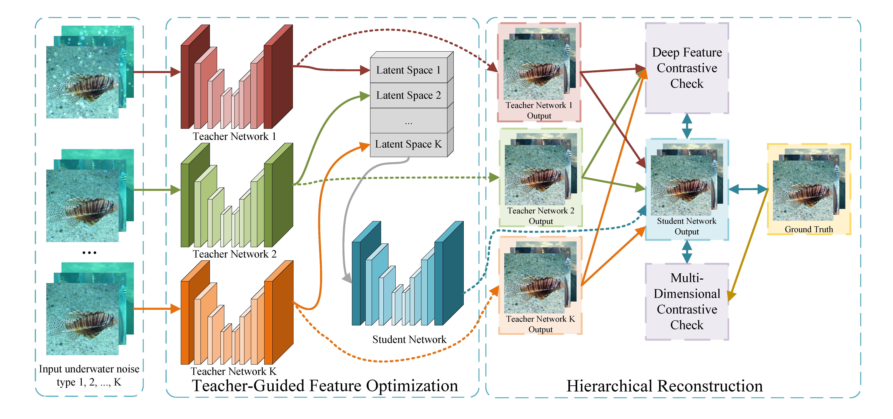
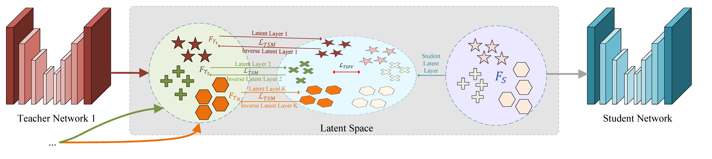

# Two-stage Joint Underwater Image Enhancement and Marine Snow Removal via Teacher-Guided Feature Optimization 🌊✨

[**UPDATE!**] 🚀 TJUMnet has now achieved a PSNR of 33.819 and an SSIM of 0.970, significantly outperforming the results reported in the paper. You can easily use TJUMnet at [Google Colab](https://colab.research.google.com/drive/12DC78HlCb9zLKKBkENHV9AF8t7-juvbS?usp=sharing). Demonstrate TJUMnet's amazing performance with just one click!

<hr />

> **Abstract:** Color shift and marine snow are two severe types of underwater imaging noise that can significantly impact subsequent computer vision tasks. However, existing methods cannot perform underwater image enhancement (UIE) and marine snow removal (MSR) simultaneously with a unified network architecture and a set of pretrained weights. To address this issue, we propose the two-stage joint UIE and MSR network (TJUMnet). With the proposed teacher-guided feature optimization (TFO) and hierarchical reconstruction (HR), TJUMnet can effectively integrate and learn feature representations under various underwater noise conditions. Additionally, we constructed a new joint underwater-image enhancement and marine-snow removal dataset (JUEMR), comprising 2700 image sets covering color shift noise and different intensities of marine snow noise. Extensive experiments on multiple benchmark datasets and the JUEMR dataset demonstrate that TJUMnet reaches state-of-the-art levels in terms of quantitative and visual performance.

## Architecture 🏗️
Check out the innovative architecture of TJUMnet! (Note: Images might not display correctly on Anonymous GitHub.)

<table>
  <tr>
    <td colspan="2" align="center">  </td>
  </tr>
  <tr>
    <td colspan="2" align="center"><p><b>TJUMnet Architecture</b></p></td>
  </tr>
  <tr>
    <td align="center">  </td>
  </tr>
  <tr>
    <td align="center"><p><b>Latent Space Architecture</b></p></td>
  </tr>
</table>

## How to Use 🚀

#### JUEMR Dataset & Pre-trained Models 📦

TJUMnet has now achieved a PSNR of 33.819 and an SSIM of 0.970, significantly outperforming the results reported in the paper. You can easily use TJUMnet at [Google Colab](https://colab.research.google.com/drive/12DC78HlCb9zLKKBkENHV9AF8t7-juvbS?usp=sharing). Demonstrate TJUMnet's amazing performance with just one click!

- **Download the JUEMR dataset** from [Google Drive](https://drive.google.com/file/d/1g9KeRR3sv_bxsHMV8HTfUK-E5o4zZ_A-/view?usp=sharing).
- **Get the best pre-trained models** from:
  - [Model 1](https://drive.google.com/file/d/1OlILJ36JjSKkV8xuQ3WV0XpMy-v1UCfm/view?usp=sharing)
  - [Model 2](https://drive.google.com/file/d/126cjMYeX1NFyAGv21PQBW1ywEumvaLZb/view?usp=sharing)

#### Training 🏋️‍♂️
To train the model, use the following command:

```bash
python train.py --train dataset/JUEMR/train --test dataset/JUEMR/test --save-dir savedir --epoch 500 --warmup_epoch 30 --lr 2e-4 --batch_size 1 --num_workers 4
```

#### Inference 🔍

To perform inference, use the following command:
```bash
python inference.py --checkpoint savedir/epoch_148_psnr33.777_ssim0.970 --savedir paper/tjumnet --num_workers 4 --dataset dataset/JUEMR/test
```
or 
```bash
python inference.py --checkpoint savedir/epoch_450_psnr33.819_ssim0.970 --savedir paper/tjumnet --num_workers 4 --dataset dataset/JUEMR/test
```

